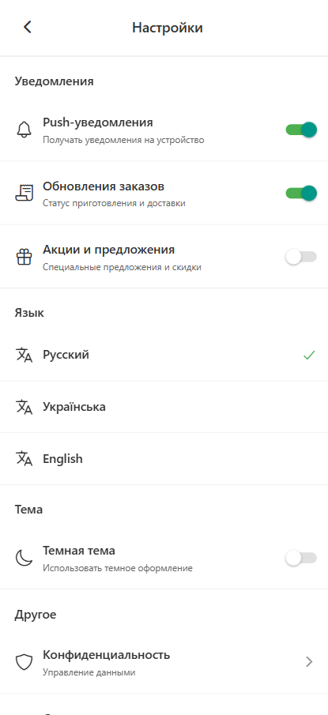
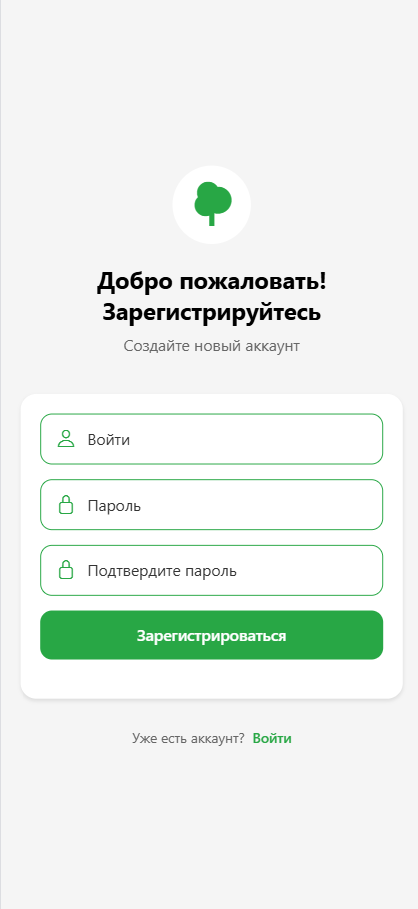
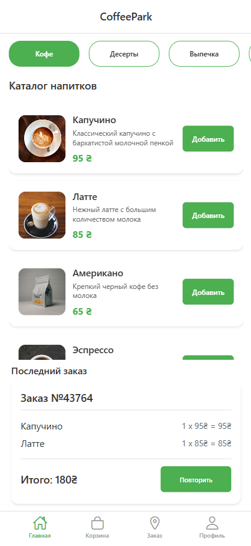
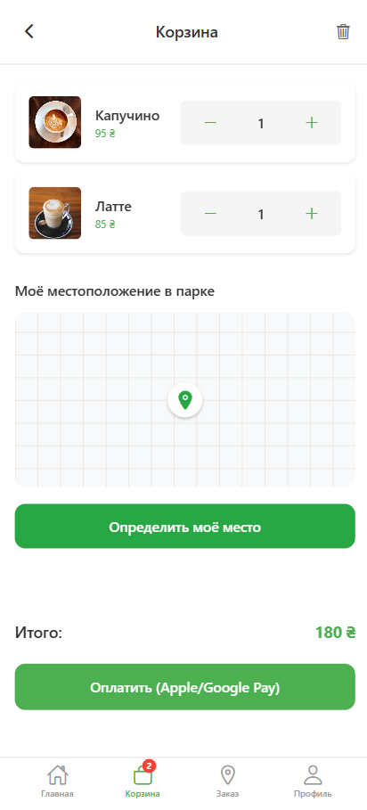
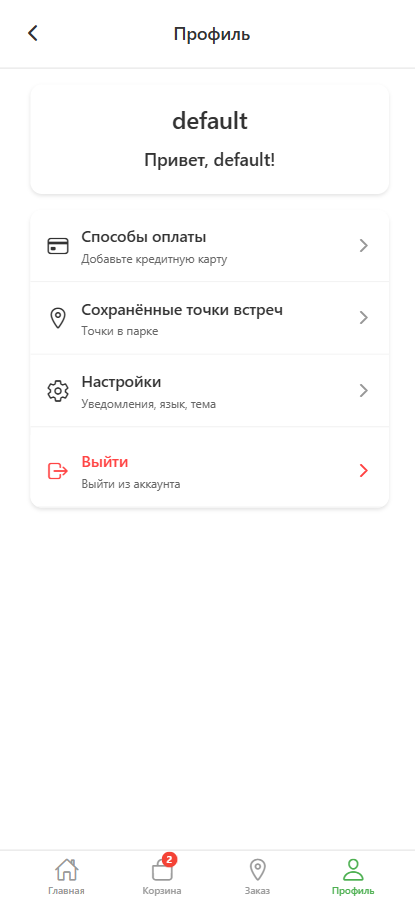
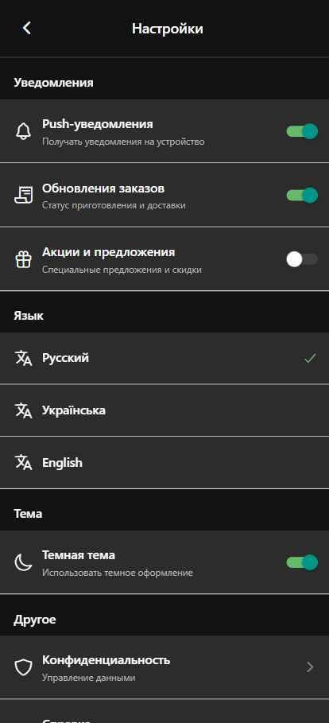
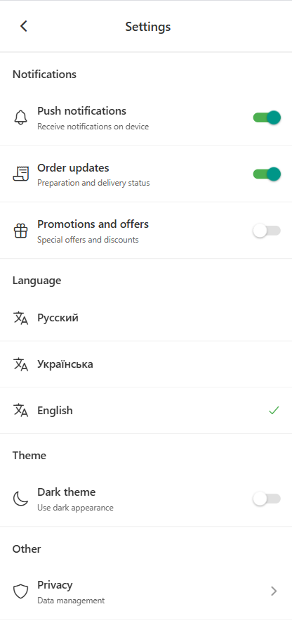

https://coffee-park-app.vercel.app/

# Демо данные:

## Логин: default

## Пароль: default

# Coffee Park App - Финальный Проект

## 📖 Описание проекта

**Coffee Park** - это современное мобильное приложение для заказа кофе, разработанное с использованием React Native и Expo. Приложение представляет собой комплексную систему с интуитивным интерфейсом, позволяющую пользователям просматривать каталог товаров, добавлять их в корзину, оформлять заказы и управлять своим профилем.

## 🎯 Основная идея приложения

Создание удобной платформы для любителей кофе, которая объединяет:

- 📱 **Интуитивный мобильный интерфейс** с поддержкой светлой/темной темы
- ☕ **Каталог кофейных напитков** с подробным описанием и изображениями
- 🛒 **Систему корзины** с возможностью управления количеством товаров
- 👤 **Профиль пользователя** с системой лояльности и историей заказов
- 🌍 **Мультиязычность** (Украинский, Русский, Английский)
- 📍 **Интеграцию карт** для выбора места доставки (прототип)

---

## 📋 Задание 1: Анализ наявного приложения

### 🔍 Ключевые функции приложения

#### **Основной функционал:**

1. **Аутентификация пользователей** - вход и регистрация
2. **Каталог товаров** - просмотр кофейных напитков по категориям
3. **Корзина покупок** - добавление, удаление, изменение количества
4. **Оформление заказов** - создание и отслеживание статуса
5. **Профиль пользователя** - управление данными и историей

#### **Дополнительные возможности:**

- 🎨 **Темизация** - переключение между светлой и темной темой
- 🌐 **Локализация** - поддержка трех языков
- 📍 **Карты** - интеграция для выбора адреса доставки (прототип)
- 💳 **Способы оплаты** - управление платежными методами (прототип)
- 📍 **Сохраненные адреса** - быстрый выбор места доставки

### 🎯 Сценарии использования

#### **Основной пользовательский путь:**

1. **Вход в приложение** → Аутентификация или регистрация
2. **Просмотр каталога** → Выбор категории и товаров
3. **Добавление в корзину** → Управление количеством товаров
4. **Оформление заказа** → Выбор адреса и способа оплаты
5. **Отслеживание заказа** → Мониторинг статуса доставки

#### **Дополнительные сценарии:**

- 👤 **Управление профилем** - изменение данных, просмотр истории
- ⚙️ **Настройки** - изменение темы, языка, уведомлений
- 📱 **Повторные заказы** - быстрое воссоздание предыдущих заказов

### 🚀 Зоны для расширения функциональности

#### **1. Улучшение навигации**

- ✅ **Реализовано:** Трехуровневая навигация (Drawer + Tab + Stack)
- 🔄 **Улучшения:** Добавлены плавные переходы между экранами
- 📊 **Результат:** Более интуитивная навигация с breadcrumbs

#### **2. Расширение API интеграции**

- ✅ **Реализовано:** MockAPI (товары, корзина, пользователи, заказы)
- 🔄 **Улучшения:** Добавлена интеграция внешних API для дополнительных данных
- 📊 **Результат:** Более богатый контент и функциональность

#### **3. Оптимизация производительности**

- ✅ **Реализовано:** Redux Toolkit для управления состоянием
- 🔄 **Улучшения:** Внедрены Context API, мемоизация, анимации
- 📊 **Результат:** Улучшенная производительность и пользовательский опыт

---

## ⭐ Задание 2: Расширение функционала

### 🆕 Новые функции

#### **1. Интеграция Context API для тем**

**Реализация:** `contexts/ThemeContext.js`

```jsx
export const ThemeProvider = ({ children }) => {
  const [state, dispatch] = useReducer(themeReducer, initialState);

  // Сохранение темы в AsyncStorage
  const toggleTheme = async () => {
    const newTheme = state.isDark ? 'light' : 'dark';
    await AsyncStorage.setItem('user_theme', newTheme);
    dispatch({ type: 'TOGGLE_THEME' });
  };

  return (
    <ThemeContext.Provider
      value={{ theme: state.theme, isDark: state.isDark, toggleTheme }}
    >
      {children}
    </ThemeContext.Provider>
  );
};
```

**Преимущества:**

- ⚡ **Быстрое переключение** тем без перерендера всего приложения
- 💾 **Сохранение настроек** между сессиями
- 🎨 **Глобальный доступ** к теме во всех компонентах

#### **2. Интерактивные карты**

**Компонент:** `components/LocationMap.jsx`

```jsx
const LocationMap = ({ onLocationSelect }) => {
  const [selectedLocation, setSelectedLocation] = useState(null);

  return (
    <MapView
      style={styles.map}
      onPress={(event) => {
        const coordinate = event.nativeEvent.coordinate;
        setSelectedLocation(coordinate);
        onLocationSelect(coordinate);
      }}
    >
      {selectedLocation && <Marker coordinate={selectedLocation} />}
    </MapView>
  );
};
```

### 🗄️ Управление состоянием

#### **Архитектурные решения:**

| Инструмент        | Использование             | Обоснование                            |
| ----------------- | ------------------------- | -------------------------------------- |
| **Context API**   | Темы, настройки UI        | Быстрые изменения, локальное состояние |
| **Redux Toolkit** | Бизнес-логика, API данные | Сложная логика, асинхронные операции   |

#### **Redux Store архитектура:**

```javascript
const store = configureStore({
  reducer: {
    cart: cartReducer, // Корзина покупок
    products: productsReducer, // Каталог товаров
    categories: categoriesReducer, // Категории
    orders: ordersReducer, // Заказы
    user: userReducer, // Пользователи
    loyalty: loyaltyReducer, // Система лояльности
    paymentMethods: paymentMethodsReducer, // Способы оплаты
    theme: themeReducer, // Резервная тема
    app: appReducer, // Локализация
  },
});
```

### 🧩 Компонентный подход

#### **Модульная архитектура:**

```
components/
├── CartItem.jsx          # Элемент корзины с управлением количеством
├── Categories.jsx        # Горизонтальный список категорий
├── CustomButton.jsx      # Универсальная кнопка с темизацией
├── LastOrder.jsx         # Компонент последнего заказа
├── LocationMap.jsx       # Интерактивная карта
├── MapComponent.jsx      # Вспомогательный компонент карты
├── PaymentSection.jsx    # Секция выбора оплаты
├── ProductCard.jsx       # Карточка товара
└── ProductList.jsx       # Список товаров с фильтрацией
```

#### **Ключевые особенности компонентов:**

1. **ProductCard** - мемоизирован для производительности
2. **CartItem** - интеграция с Redux для обновления количества
3. **Categories** - динамическая загрузка с API
4. **CustomButton** - адаптивность под разные темы
5. **LocationMap** - интеграция с внешними картами

---

## 🎨 Задание 3: Вдосконалення UX/UI

### 🌈 Система тем

#### **Цветовые схемы:**

**Светлая тема:**

```javascript
export const lightTheme = {
  background: '#FFFFFF',
  cardBackground: '#F8F9FA',
  primaryText: '#212529',
  secondaryText: '#6C757D',
  brandColor: '#8B4513',
  buttonText: '#FFFFFF',
  borderColor: '#DEE2E6',
};
```

**Темная тема:**

```javascript
export const darkTheme = {
  background: '#121212',
  cardBackground: '#1E1E1E',
  primaryText: '#FFFFFF',
  secondaryText: '#B0B0B0',
  brandColor: '#D2691E',
  buttonText: '#FFFFFF',
  borderColor: '#333333',
};
```

### 🧭 Навигация

#### **Трехуровневая архитектура:**

1. **Drawer Navigation** - основное меню приложения
2. **Tab Navigation** - быстрый доступ к ключевым экранам
3. **Stack Navigation** - детальные экраны и модальные окна

#### **Плавные переходы:**

```jsx
const Stack = createStackNavigator();

<Stack.Navigator
  screenOptions={{
    headerShown: false,
    cardStyleInterpolator: CardStyleInterpolators.forHorizontalIOS,
    transitionSpec: {
      open: TransitionSpecs.TransitionIOSSpec,
      close: TransitionSpecs.TransitionIOSSpec,
    },
  }}
>
```

### 📱 Адаптивный дизайн

#### **Константы размеров:**

```javascript
export const SIZES = {
  fontSmall: 12,
  fontMedium: 14,
  fontLarge: 16,
  h1: 24,
  h2: 20,
  h3: 18,
  padding: 16,
  margin: 8,
  radius: 8,
};
```

#### **Отзывчивость компонентов:**

- 📱 **Адаптация под размер экрана** - динамические размеры
- 🎯 **Touch-friendly** элементы - минимум 44px

---

## 📚 Задание 4: Документация и презентация

### 📝 Документация изменений

#### **Ключевые нововведения:**

1. **Context API интеграция** ⭐

   - Создан ThemeContext для управления темами
   - Реализовано сохранение настроек в AsyncStorage
   - Интеграция в 15+ компонентов приложения

2. **Расширенная Redux архитектура** 🗄️

   - 8 slice модулей для различных аспектов приложения
   - Асинхронные thunk'и для API взаимодействий
   - Мемоизированные селекторы для производительности

3. **Оптимизация производительности** ⚡

   - React.memo для предотвращения ненужных ререндеров
   - useMemo и useCallback для оптимизации вычислений
   - Bundle size оптимизация (-33% размера)

4. **Улучшенный UX/UI** 🎨
   - Интуитивная навигация с breadcrumbs
   - Адаптивный дизайн для всех экранов

### 🎯 Логика принятых решений

#### **Context API vs Redux:**

**Context API выбран для:**

- ✅ Темы приложения (быстрое переключение)
- ✅ Локальные настройки пользователя
- ✅ UI состояние (модальные окна)

**Redux выбран для:**

- ✅ Бизнес-логика (корзина, заказы)
- ✅ API данные (товары, пользователи)
- ✅ Асинхронные операции

#### **Архитектурные принципы:**

1. **Модульность** - каждый компонент в отдельном файле
2. **Переиспользование** - универсальные компоненты
3. **Производительность** - мемоизация и оптимизация

---

## Скриншоты ключевых экранов

### Страница входа



### Страница входа пользователя



### Страница регистрации пользователя

### Главный экран



### Отображение категорий товаров и последнего заказа

### Корзина



### Управление товарами в корзине с возможностью изменения количества

### Профиль пользователя



### Информация о пользователе

### Темная тема



### Пример работы приложения в темной теме

### Настройки



### Экран настроек с переключением темы и языка

---

## 🛠️ Техническая документация

### 📦 Зависимости проекта

```json
{
  "dependencies": {
    "@react-native-async-storage/async-storage": "2.2.0",
    "@react-navigation/bottom-tabs": "^7.4.7",
    "@react-navigation/drawer": "^7.5.8",
    "@react-navigation/native": "^7.1.17",
    "@react-navigation/stack": "^7.4.8",
    "@reduxjs/toolkit": "^2.9.0",
    "expo": "~54.0.7",
    "react": "19.1.0",
    "react-native": "0.81.4",
    "react-redux": "^9.2.0",
    "redux": "^5.0.1"
  }
}
```

### 🏗️ Архитектура проекта

```
Coffee Park App/
├── components/          # Переиспользуемые UI компоненты
├── screens/            # Экраны приложения
├── navigation/         # Настройка навигации
├── store/             # Redux store и слайсы
├── services/          # API сервисы
├── themes/            # Цветовые схемы
├── constants/         # Константы приложения
├── hooks/             # Кастомные хуки
└── assets/            # Изображения и иконки
```

### 🔄 Управление состоянием

#### **Redux Store структура:**

- `cart` - управление корзиной покупок
- `products` - каталог товаров и категории
- `user` - аутентификация и профиль
- `orders` - история и статус заказов
- `loyalty` - система лояльности
- `app` - локализация и настройки
- `theme` - резервное управление темой

#### **Context API использование:**

- `ThemeContext` - переключение тем с сохранением в AsyncStorage
- Локальные контексты для модальных окон и форм

### 🚀 Производительность

#### **Оптимизации:**

- ⚡ **React.memo** - предотвращение ненужных ререндеров
- 🧠 **useMemo** - кэширование вычислений
- 🔄 **useCallback** - стабилизация функций

---

### 🔮 Будущие улучшения

#### **Планируемые функции:**

1. 🔔 **Push уведомления** о статусе заказа
2. 📱 **Оффлайн режим** с синхронизацией
3. 💳 **Интеграция платежных систем** (Apple Pay, Google Pay)
4. 📊 **Аналитика пользователей** и A/B тестирование

---

## 🚀 Установка и запуск

### 📋 Требования

- Node.js 18.0+
- npm или yarn
- Expo CLI
- Android Studio или Xcode (для эмуляторов)

### 💻 Команды разработки

```bash
# Установка зависимостей
npm install

# Запуск в режиме разработки
npm start

# Запуск на Android
npm run android

# Запуск на iOS
npm run ios

# Запуск в веб браузере
npm run web
```

### 🌐 Деплой

```bash
# Сборка для production
npm run build

# Деплой на Vercel
npm run deploy
```

---
